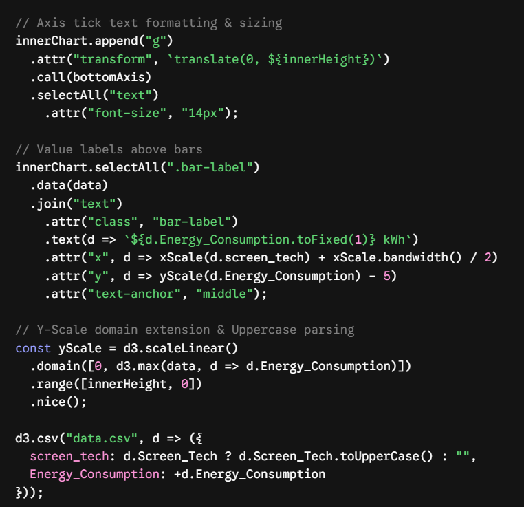

## Introduction ##
AI assistance was used in this project for the creation of interactive data visulisations using D3.js. AI was mainly used for debugging, layout aesthetics, and JavaScript formatting.

## Tool Description ##
Gemini (Google AI): Adaptive conversational artificial intelligence model that is used for code generation, debugging and data visualization.

## Usage Details ##
## Prompt Used ##
- "how can I make the font size of the screen type bigger"
- "how do I add the kwh value on top of the bar"
- "how do I round it off and have kwh at the end"
- "how can I extend the line a bit higher"
- "how can I make the led, oled, lcd label to capital letters"

## Outputs Received ##

## Modification Made ##

- Used the .tickFormat(d => d.toUpperCase()) directly to the bottomAxis creator to keep the raw data unchanged while formatting the axis label.

- MaxValue * 1.15 was used to give room for the tallest bar from clipping the dynamically created text.

- d3.format(",0f") was used within the template literal to format integers as strings with units of measure (kwh).  

## Reflection ##

The use of AI reduced the time taken to search for the syntax used in D3.js selections and scales. Rather than manually searching for syntax such as .nice() and the d3.format() in the documentation, all I had to do was ask in conversational form and receive relevant code snippets.

Using AI also help me to understand the code snippets and how can I modify them according to my needs.