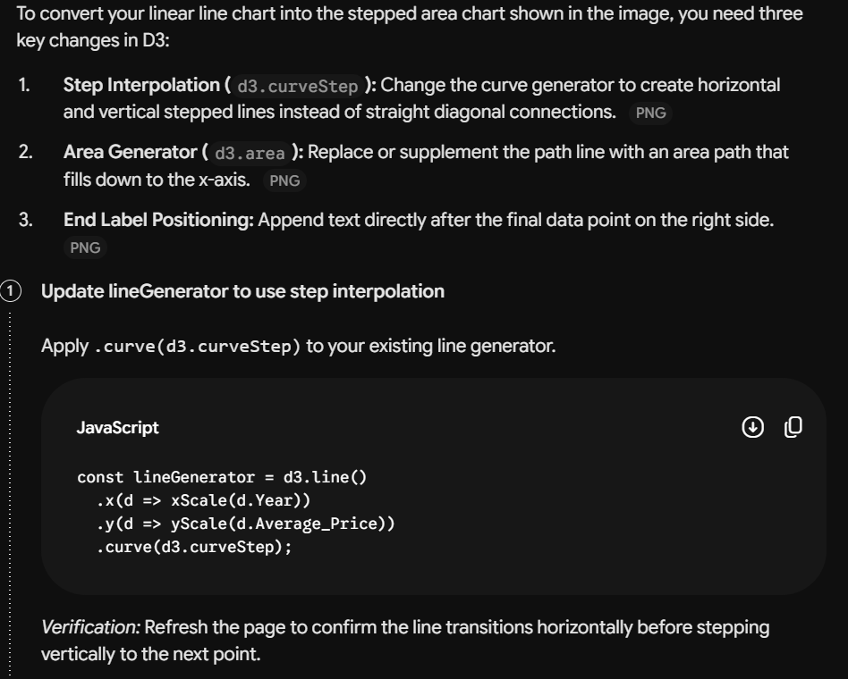

## Introduction ##
AI assistance was used in this project for the creation of interactive data visulisations using D3.js. AI was mainly used for debugging, layout aesthetics, and JavaScript formatting.

## Tool Description ##
Gemini (Google AI): Adaptive conversational artificial intelligence model that is used for code generation, debugging and data visualization.

## Usage Details ##
## Prompt Used ##
- "how can I change from line chart to this design" [provided screenshot of the last image from the lab guidance]

## Outputs Received ##
, (image-1.png), (image-2.png)

## Modification Made ##

- New areaGenerator was added using d3.area() with the value of y0 set to innerHeight and y1 set to (d=>yScale(d.Average_Price))

- A new <path> element was added to represent price volume with the color light green and opacity 0.5

## Reflection ##

AI helped make it easier to learn how D3 creates area plots in addition to the regular line generators. Rather than manually searching for syntax such as d3.area(), all I had to do was ask in conversational form and receive relevant code snippets.

Using AI also helped me to understand the code snippets and how I can modify them according to my needs.