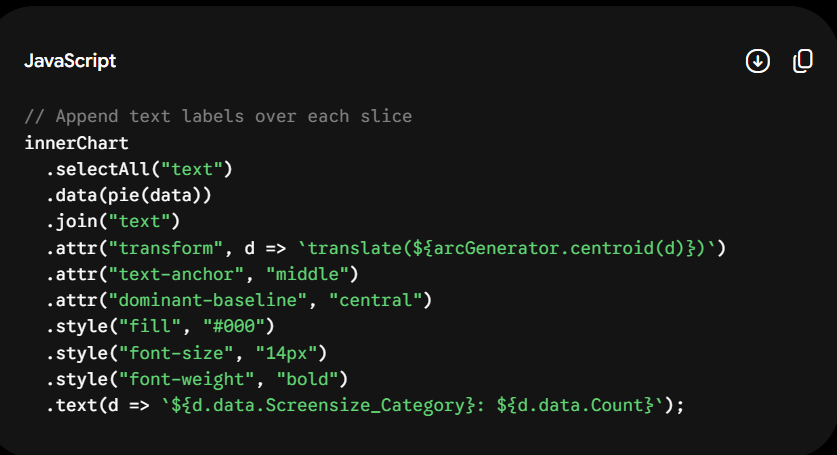

## Introduction ##
AI assistance was used in this project for the creation of interactive data visualizations using D3.js. AI was mainly used for debugging, layout aesthetics, and JavaScript formatting.

## Tool Description ##
Gemini (Google AI): Adaptive conversational artificial intelligence model that is used for code generation, debugging and data visualization.

## Usage Details ##
## Prompt Used ##
- "d3.csv("./data/Data_exercise 5.3.csv", d => { ... } how can I add text for the sizes on the donut chart"

## Outputs Received ##

## Modification Made ##

- Chose to display only the screen size category name instead of combining it with the count value.

- Used the arcGenerator.centroid(d) in the transform attribute to set the center location of each label on its respective slice

- Applied inline CSS style using the .style("text-anchor", "middle") for horizontal allignment and .style("font-size", 12) for appropriate font size.

## Reflection ##

AI made it easier and faster to find the syntax needed to create the layouts arc centroids using D3.js. Instead of searching for documentation of the D3 shape to understand how the midpoints of the slice are computed, a direct and relevant solution is generated using the conversation.

Using AI also made it easy to understand how the data is bound using d3.pie() and transformed using the arc transforms.