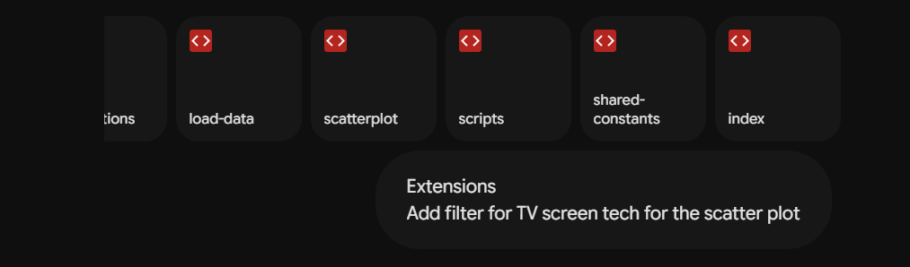
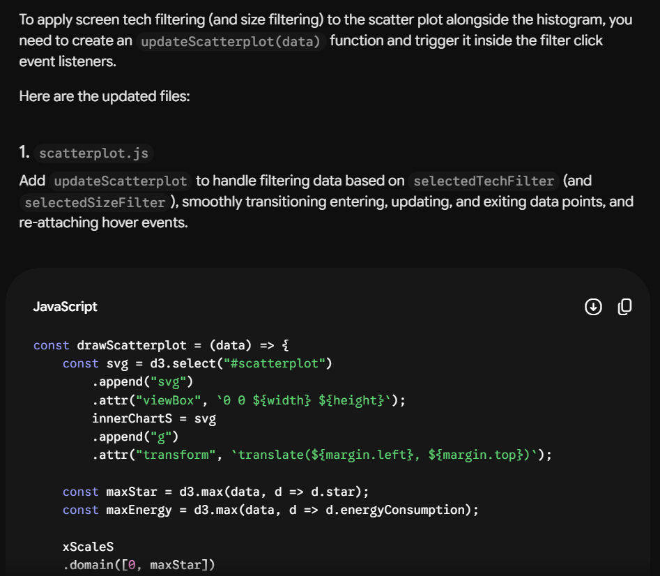
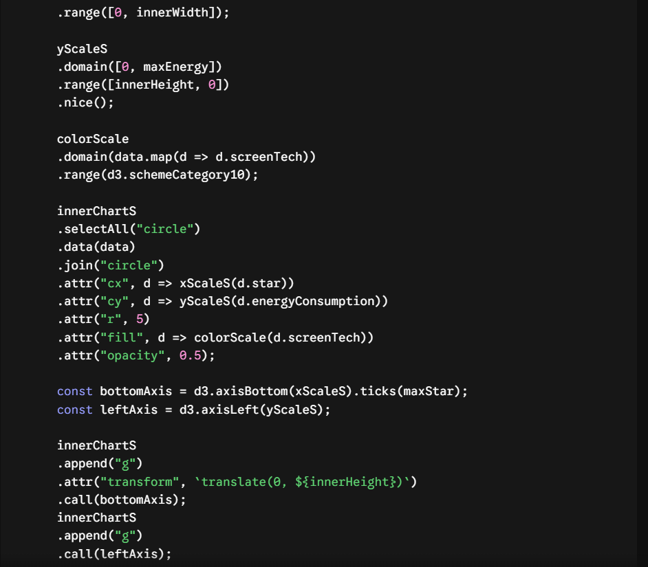
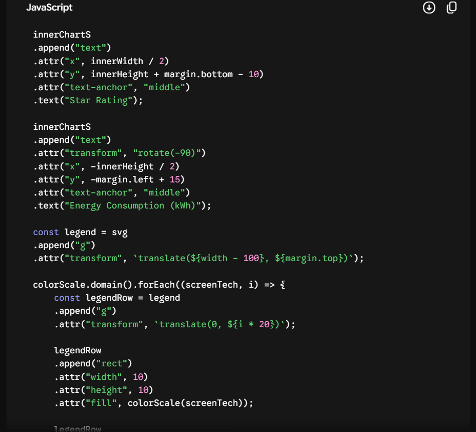
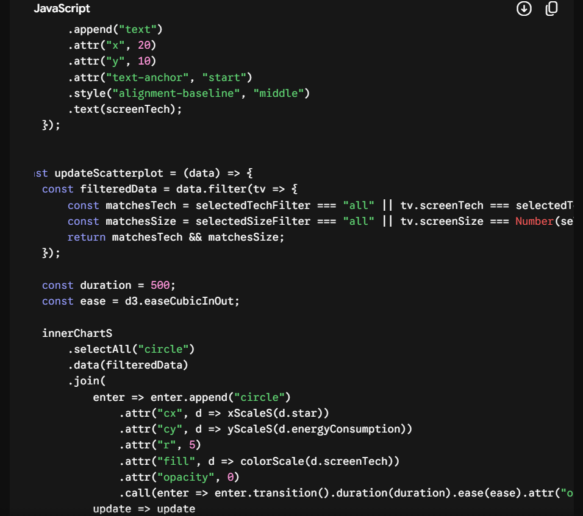
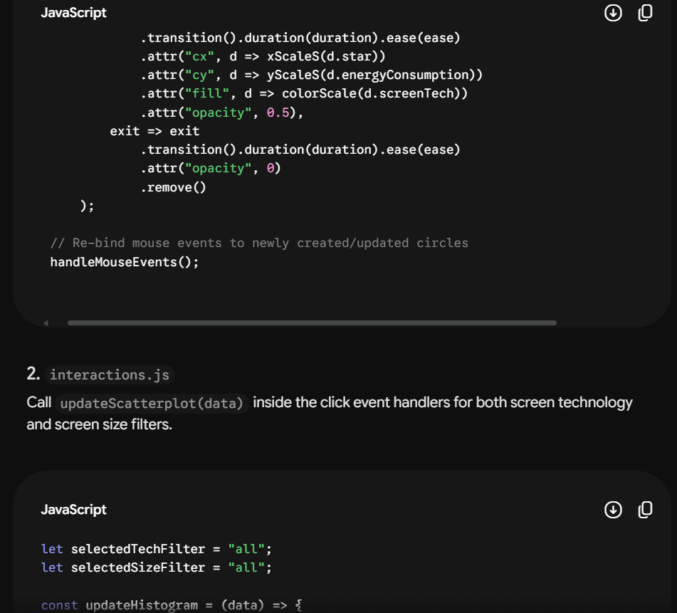
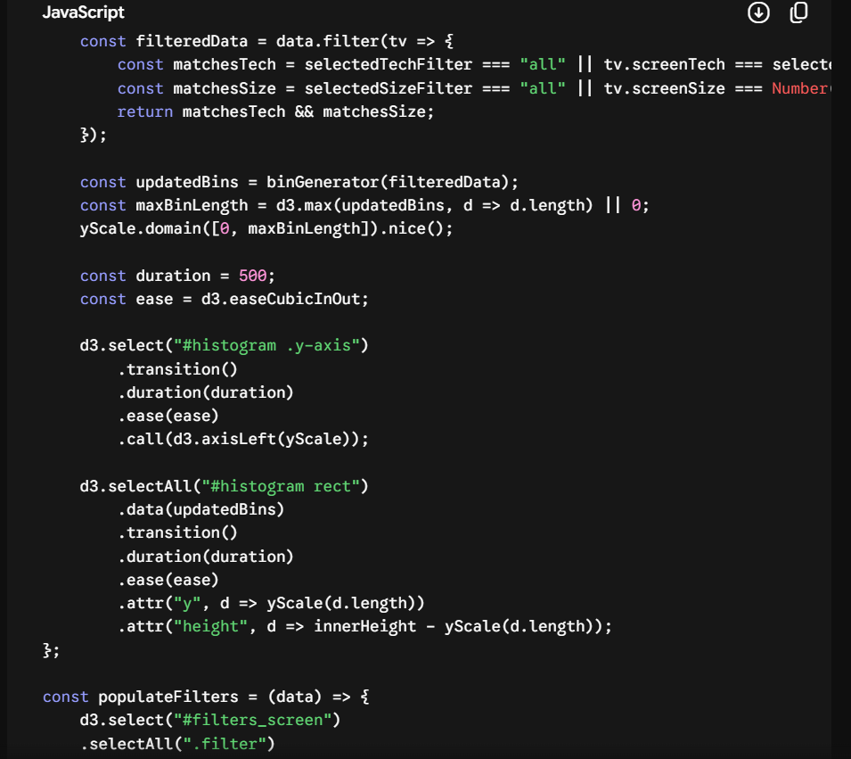
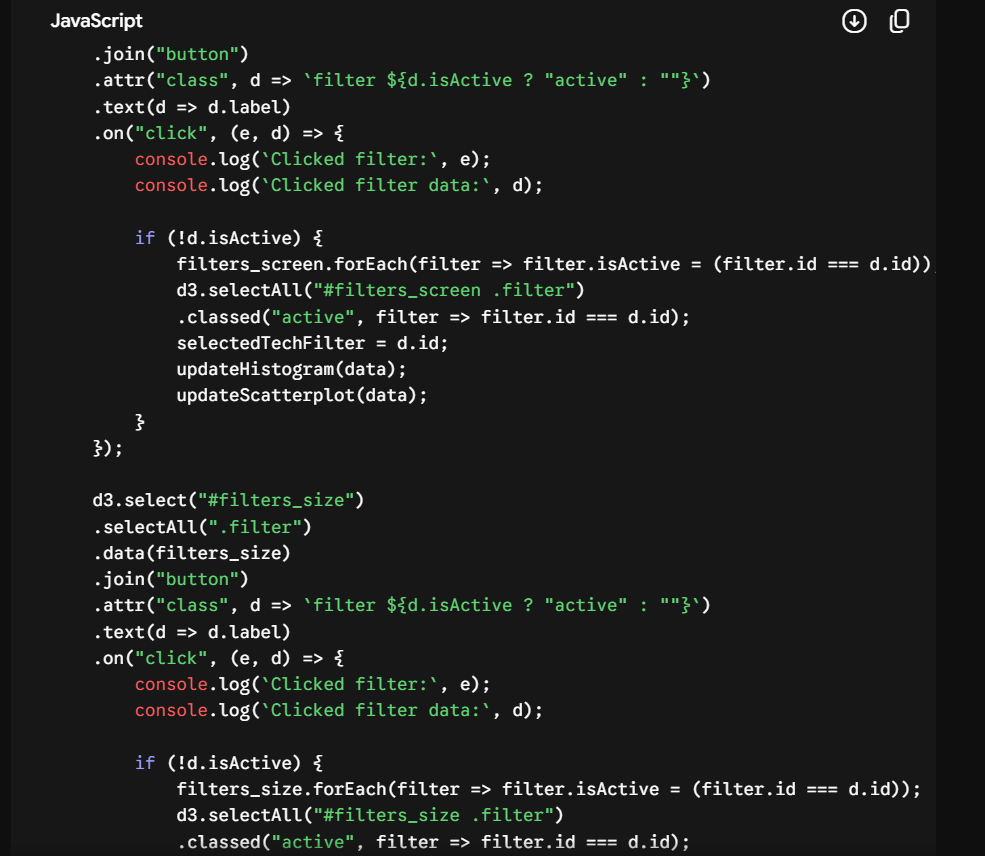
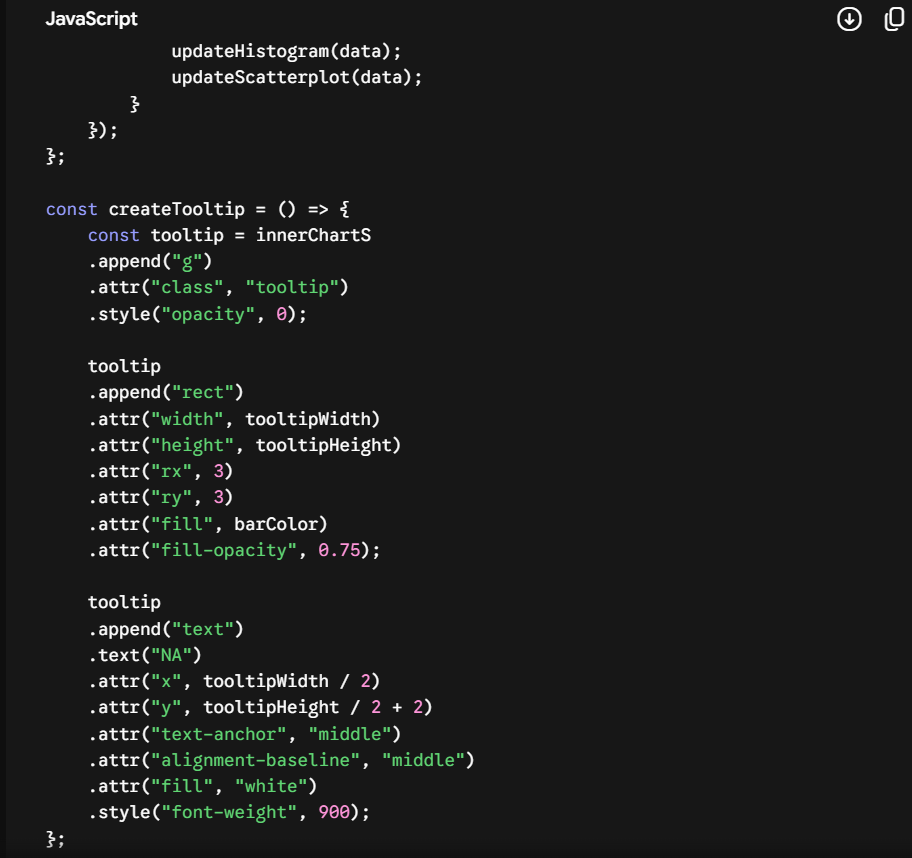
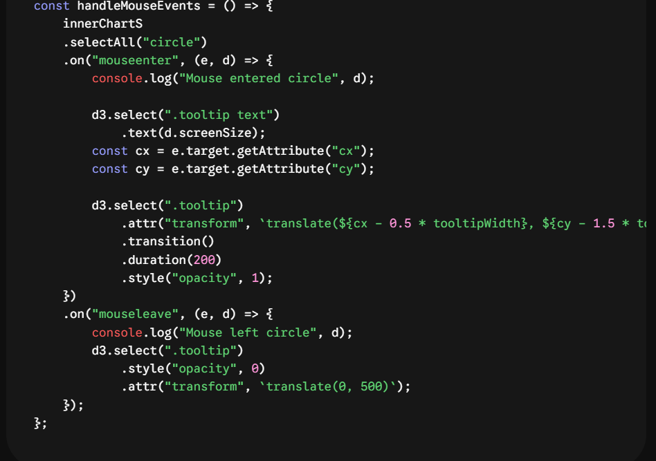

## Introduction ##
AI assistance was used in this project for the creation of interactive data visualisation using D3.js. AI was mainly used for dynamic filtering features, updating the visualization states, and JavaScript functions.

## Tool Description ##
Gemini (Google AI): Adaptive conversational artificial intelligence model that is used for code generation, debugging and data visualization.

## Usage Details ##
## Prompt Used ##
- "Extensions: Add filter for TV screen tech for the scatter plot"

## Outputs Received ##

## Modification Made ##

- Kept the dual filter logic (selectedTechFilter and selectedSizeFilter), which allows simultaneous functionality of both screen technology and screen size filters in both visualisations. 

- The mouse hover event handlers were rebound (handleMouseEvents()) after performing an element join to allow tooltips to work correctly on updated DOM elements.

- AI assistance was used in this lab for creating interactive data visualisation using D3.js.  

## Reflection ##

The AI helped me implement the D3 enter-update-exit pattern for filtering scatterplot items dynamically. The entire pattern was given directly, instead of manually parsing D3 v7 data joins and selection transitions to remove old circles and animate new ones. 

AI also helped me understand how to maintain global filters for both histogram and scatterplot visualisations. This ensures that there is no redundant code, such as filtering on different charts.